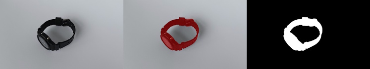

# prompt-mask 



<sub>From left to right: input image, visualization overlay, binary mask.</sub>

Generate **COLMAP-compatible binary masks** from RGB images using a **text prompt**, leveraging [Grounding DINO](https://github.com/IDEA-Research/GroundingDINO) and [Segment Anything](https://github.com/facebookresearch/segment-anything) via Hugging Face `transformers`.

- Input: A folder of RGB images and a descriptive text prompt  
- Process: Detect objects with Grounding DINO, then segment them using SAM  
- Output: Binary masks suitable for COLMAP (`255` = object, `0` = background)  
- Optional visualization outputs for qualitative inspection

## Installation

To run this project with GPU acceleration, a CUDA-enabled version of PyTorch must be installed.

### Option 1: With CUDA (recommended)

The `requirements.txt` file includes an extra index URL for PyTorch wheels:

```
--extra-index-url https://download.pytorch.org/whl/cu126
torch
transformers
opencv-python
Pillow
tqdm
fire
```

Make sure to adjust the CUDA version (`cu126`) in the index URL to match the system configuration.  
Refer to the [PyTorch installation guide](https://pytorch.org/get-started/locally/) to determine the correct version.

Install with:

```bash
pip install -r requirements.txt
```

### Option 2: Manual installation (CPU or custom setup)

1. Install PyTorch according to the system configuration by following the official instructions:  
   [https://pytorch.org/get-started/locally](https://pytorch.org/get-started/locally)

2. Then install the remaining packages:

```bash
pip install transformers opencv-python Pillow tqdm fire
```

## Usage

```bash
python prompt_mask.py \
  --images_dir examples/watch/images \
  --output_mask_dir examples/watch/masks \
  --prompt "watch . dial" \
  --output_visualization_dir examples/watch/visualizations
```

### Arguments

| Argument                      | Description                                                                 |
|-------------------------------|-----------------------------------------------------------------------------|
| `--images_dir`                | Path to the input folder containing `.jpg` / `.png` images                  |
| `--output_mask_dir`           | Path to the output folder for binary mask images                           |
| `--prompt`                    | Text prompt. Use multiple labels separated by periods (e.g. `"watch . dial"`) |
| `--output_visualization_dir` | (Optional) Folder to save visual overlay images                            |
| `--threshold`                 | Detection confidence threshold (default: `0.5`)                            |

## Using with COLMAP

The generated masks are fully compatible with **COLMAP's `ImageReader.mask_path`**, which supports excluding masked regions during feature extraction.

### Example command

```bash
colmap feature_extractor \
  --image_path examples/watch/images \
  --ImageReader.mask_path examples/watch/masks \
  --database_path examples/watch/database.db \
  --SiftExtraction.use_gpu 1 \
  --ImageReader.single_camera 1
```

Adjust paths to match the project directory structure.

### COLMAP mask format

- For an image `images/abc/xyz.jpg`, the corresponding mask must be named:  
  `masks/abc/xyz.jpg.png`
- This naming convention is automatically handled by `prompt_mask.py`
- Masks must be grayscale `.png` images:
  - **White (255)** = included in feature extraction  
  - **Black (0)** = excluded from feature extraction

## Repository Structure

```
prompt-mask/
├── prompt_mask.py                 ← main script
├── requirements.txt
├── examples/
│   └── watch/
│       ├── images/
│       ├── masks/
│       ├── visualizations/
│       └── watch_example.jpg
```

## Credits

This project was built using:

- [Grounding DINO](https://github.com/IDEA-Research/GroundingDINO)
- [Segment Anything (SAM)](https://github.com/facebookresearch/segment-anything)
- [Hugging Face Transformers](https://huggingface.co/docs/transformers)

Parts of the code and usage patterns were adapted from  
[Combining Grounding DINO with Segment Anything (SAM) for text-based mask generation](https://github.com/NielsRogge/Transformers-Tutorials/blob/master/Grounding%20DINO/GroundingDINO_with_Segment_Anything.ipynb)

## License

This project is licensed under the [MIT License](https://opensource.org/licenses/MIT).

© 2025 SmartDataScan